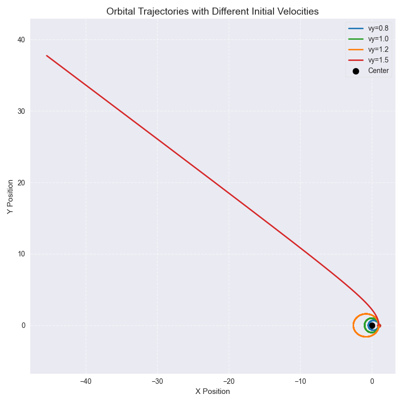
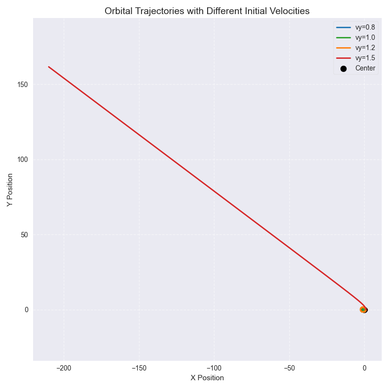
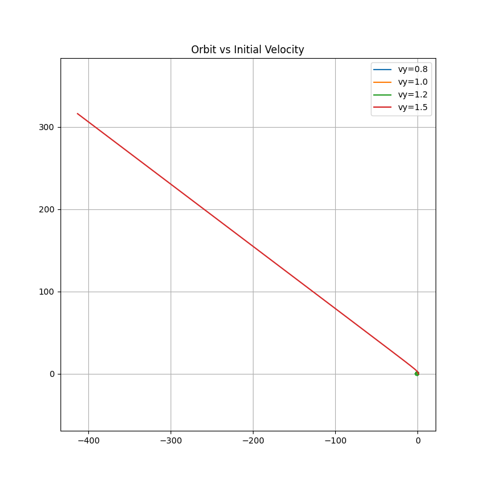
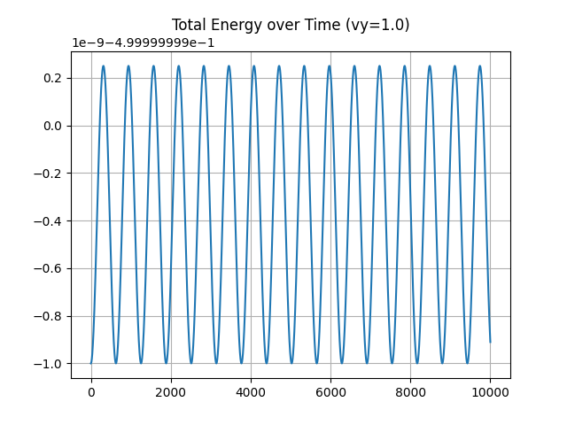
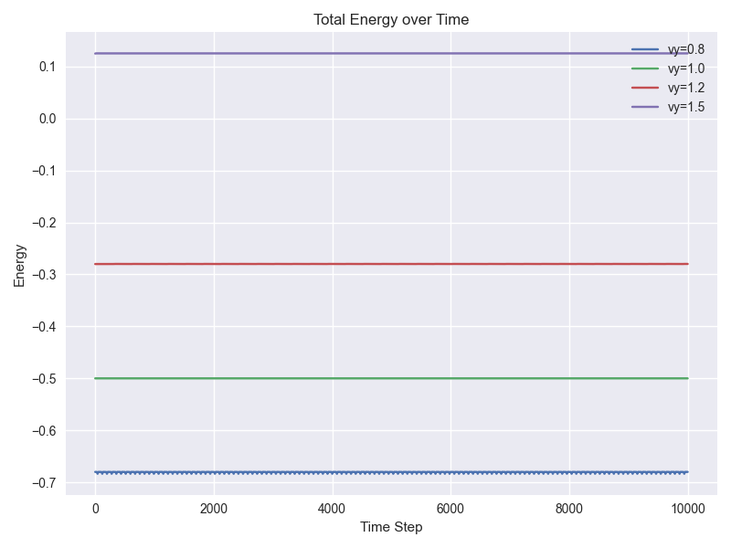
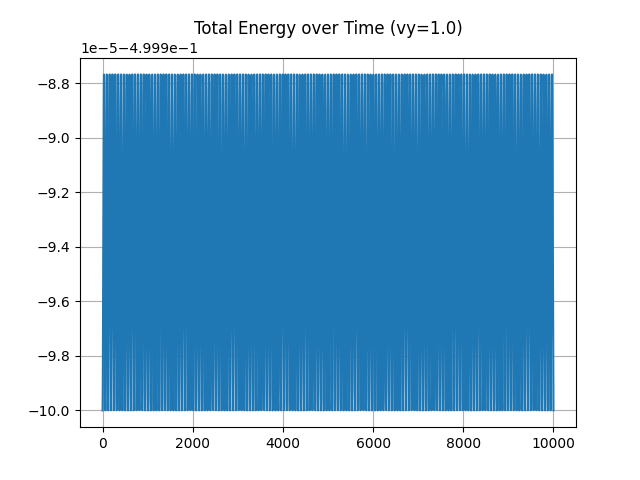

# 2D-orbit-simulator
# 2D Orbital Mechanics Simulator

이 프로젝트는 중력 법칙을 기반으로 만든 2D 궤도 시뮬레이터입니다.
물체의 위치와 속도를 바탕으로 시간에 따른 궤도 변화를 계산하고 시각화합니다.
항공우주 분야에 대한 흥미와 관심으로 시작했으며, 단순한 이론 이해를 넘어 궤도 운동을 직접 구현해보고자 했습니다.  
특히 물체의 위치와 속도에 따라 궤도가 어떻게 변화하는지 코드로 확인하고, 이를 시각화하는 것을 목표로 개발했습니다.

## 개요
- 뉴턴 만유인력 기반 2D 궤도 시뮬레이션
- Euler와 Leapfrog 적분법 비교
- 궤도 안정성 및 시간 간격(dt) 민감도 실험

## 주요 기능
1. 원/타원/탈출 궤도 시뮬레이션
2. Leapfrog integrator를 사용한 수치 안정성 개선
3. 속도(vy)와 시간 간격(dt) 변경 실험
4. 궤도 시각화 및 에너지 계산

## 설치 및 실행 방법
```bash
git clone <repo-url>
pip install numpy matplotlib
python orbit_simulator.py
```
## 프로젝트 소개

- 뉴턴 만유인력 기반 2D 궤도 시뮬레이션
- Leapfrog 적분법으로 수치 안정성 향상
- 속도(vy)와 시간 간격(dt)를 바꿔가며 궤도와 에너지 변화 분석
- 코드 구조화: `simulate()`, `compute_energy()`, `plot_orbit()`, `plot_energy()` 함수

## 주요 기능
1. 원, 타원, 탈출 궤도 시뮬레이션
2. Leapfrog integrator를 사용한 수치 안정성 개선
3. 속도(vy)와 시간 간격(dt) 변경 실험
4. 궤도 및 에너지 시각화

## 실험 결과 및 분석

- 실험 목적: 시간 간격(dt) 변화에 따른 초기 속도(vy)에 따른 궤도 안정성과 에너지 보존 확인
- 실험 조건: dt = 0.05, vy = 0.8, 1.0, 1.2, 1.5

### Tech Stack
- Python
- NumPy: 물리 기반 수치 계산
- Matplotlib: 궤도 시각화
- 
### 결과 요약
속도별 특징:
- vy=0.8: 타원 궤도, 에너지 거의 일정, 안정적
- vy=1.0: 원 궤도, 기준 속도, 에너지 일정
- vy=1.2: 타원 궤도, 에너지 약간 증가, 궤도 점프 길어짐 
- vy=1.5: 탈출 궤도, 에너지 증가, 궤도 벗어남 

### 궤도 그래프





### 에너지 그래프 (vy=1.0)





### 결론
- Leapfrog 방법은 안정적이며 에너지 보존이 뛰어나지만, dt가 커지면 정확도가 감소
- 속도가 기준 속도에서 벗어나면 궤도가 타원화 또는 탈출 궤도로 변함
- 시뮬레이션과 그래프 시각화를 통해 물리적 직관과 수치 안정성을 동시에 확인 가능

### Retrospective (문제 해결 및 회고)
1. 프로젝트 개요
중력 법칙을 기반으로 2D 궤도 운동을 시뮬레이션하고 시각화한 프로젝트입니다.
NumPy를 활용한 수치 계산과 Matplotlib을 통한 시각화를 통해 궤도 변화를 확인할 수 있도록 구현했습니다.

2. 개발 동기
항공우주 분야에 대한 관심을 단순한 이론 이해에서 끝내지 않고, 실제 코드로 구현해보고자 시작했습니다.
특히 물체의 위치와 속도에 따라 궤도가 어떻게 변하는지 "눈으로 확인할 수 있는 형태"로 만들고 싶었습니다.

3. 문제 해결 과정
   
1) 수치 해석 및 적분 방식
궤도 운동을 구현하는 과정에서 단순 공식 적용이 아닌, 시간 단위로 분할하여 계산하는 수치 적분 방식이 필요했습니다. 이 과정에서 시간 간격(dt)에 따라 결과가 크게 달라지는 문제를 경험하며, 수치 해석에서의 근사 방식과 안정성이 결과에 큰 영향을 준다는 점을 이해하게 되었습니다.

2) 코드 구조 설계
시뮬레이션 로직과 시각화 로직을 분리하는 과정에서 코드 구조화를 고민했습니다.
simulate, plot_energy 등의 기능을 분리하면서 각 함수의 역할을 명확히 하는 것이 유지보수성과 가독성에 중요하다는 것을 배웠습니다.

3) 시각화 문제 해결
matplotlib을 사용하여 결과를 시각화하는 과정에서 그래프가 여러 번 겹쳐 출력되거나 한 번에 정상적으로 표시되지 않는 문제가 있었습니다. 이를 해결하기 위해 plt.show() 호출 흐름과 필요성을 깨닫고 시각화 제어 방법을 익혔습니다.

4) git 및 프로젝트 관리
github에 프로젝트를 업로드하는 과정에서 push 오류 및 브랜치 관련 문제를 경험했습니다.  
이를 해결하면서 Git의 기본적인 동작 방식과 로컬-원격 저장소 간의 관계를 이해하게 되었습니다.

4. 배운 점
작은 수치 설정이 결과에 큰 영향을 줄 수 있다는 점에서 모델링 과정의 중요성을 이해하게 되었습니다.
단순한 수식 구현이 아닌, 이를 시간 축으로 확장한 "시뮬레이션 사고"가 중요하다는 것을 배웠습니다.
